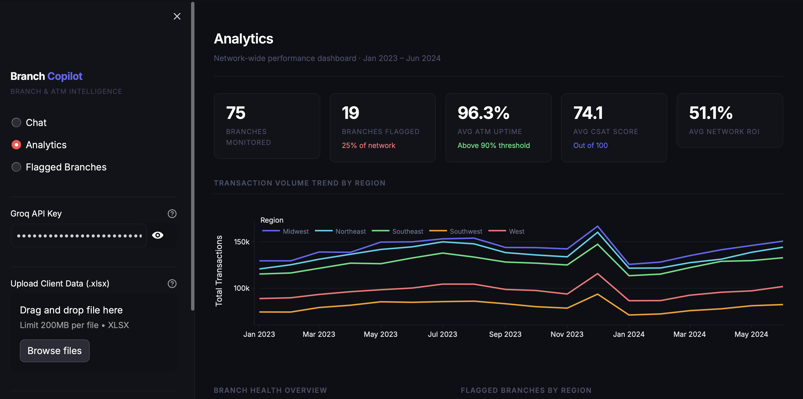
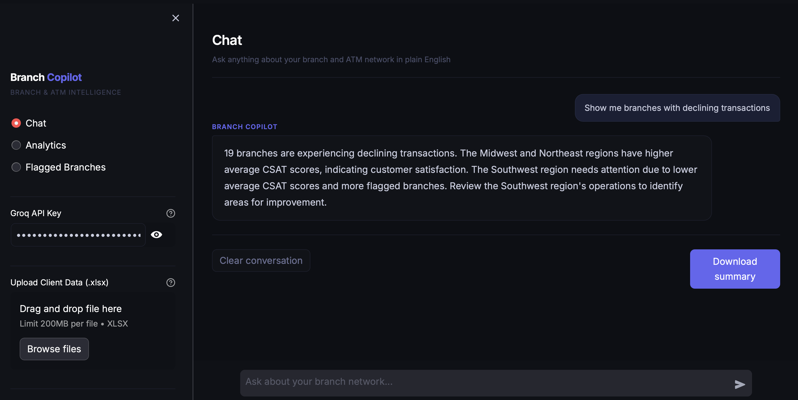
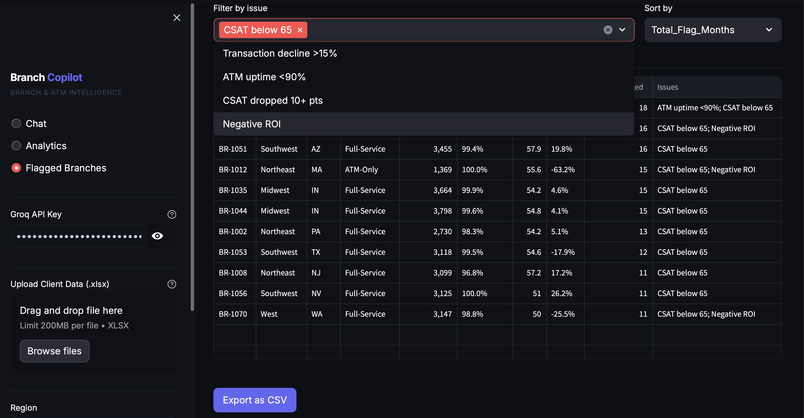

# Branch Copilot

> AI-powered branch & ATM performance analytics for regional banks.

Branch Copilot automates the manual process of analyzing branch and ATM performance data. Upload a client's Excel report and instantly get AI-driven insights, interactive charts, and a filterable view of every underperforming branch — no data skills required.

---

## Screenshots

### Analytics Dashboard


### AI Chat


### Flagged Branches


---

## What It Does

- **Automated flagging** — identifies underperforming branches using 5 business rules (ATM uptime, CSAT score, transaction decline, CSAT drop, negative ROI)
- **AI chat** — ask questions in plain English, get concise answers backed by real data (powered by Groq + LLaMA 3.3 70B)
- **Interactive analytics** — transaction trends, branch health overview, regional breakdowns, ATM uptime charts
- **Filterable branch table** — filter by issue type, sort by any metric, export as CSV
- **Word brief export** — one-click download of a client-ready summary document
- **File upload** — swap in any compatible Excel report to analyze a different client

---

## Tech Stack

| Layer | Tool |
|-------|------|
| Web app | Streamlit |
| Charts | Plotly |
| AI | Groq API (LLaMA 3.3 70B) |
| Data pipeline | pandas, numpy |
| Excel output | openpyxl |
| Word export | python-docx |

---

## Project Structure

```
├── app.py                  # Streamlit web app (3 pages: Chat, Analytics, Flagged Branches)
├── pipeline.py             # Data cleaning, metric calculation, anomaly flagging
├── generate_data.py        # Synthetic data generator (75 branches × 18 months)
├── generate_demo_files.py  # Generates demo Excel files for testing
├── ai_summary.py           # Standalone CLI tool for AI-generated Word briefs
├── demo_mixed.xlsx         # Demo dataset with realistic regional variability
```

---

## Flagging Rules

Branches are automatically flagged if any of these thresholds are breached:

| Rule | Threshold |
|------|-----------|
| Transaction decline | >15% below 3-month rolling average for 2+ consecutive months |
| ATM uptime | Below 90% in any month |
| CSAT score | Below 65/100 |
| CSAT drop | Dropped 12+ points over 3 months |
| Negative ROI | ROI below −20% |

---

## Getting Started

**1. Install dependencies**
```bash
pip install streamlit plotly pandas openpyxl groq python-docx numpy
```

**2. Run the app**
```bash
streamlit run app.py
```

**3. Upload data**

Upload `demo_mixed.xlsx` (included) via the sidebar, or run `pipeline.py` on your own data first.

**4. Add your Groq API key**

Paste your [Groq API key](https://console.groq.com) in the sidebar to enable the Chat page. Free tier is sufficient.

---

## Data Pipeline

To run the pipeline on raw data:
```bash
python generate_data.py        # generates raw_branch_atm_data.csv
python pipeline.py             # outputs branch_atm_report.xlsx
streamlit run app.py           # upload branch_atm_report.xlsx in the sidebar
```

The pipeline outputs a 4-sheet Excel workbook (`branch_atm_report.xlsx`) that also works as a Power BI data source.

---

## Power BI Integration

The same Excel file that Branch Copilot reads can be uploaded directly to Power BI Online for client-facing dashboards. The pipeline handles all data prep — Power BI picks up from there for map visuals, matrix tables, and cross-visual filtering.

---

*Built with Python · Streamlit · Groq AI*
